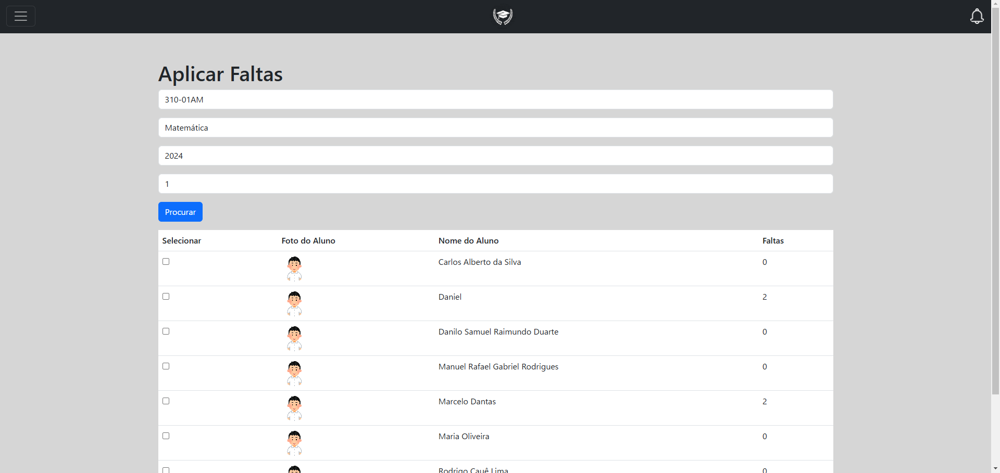
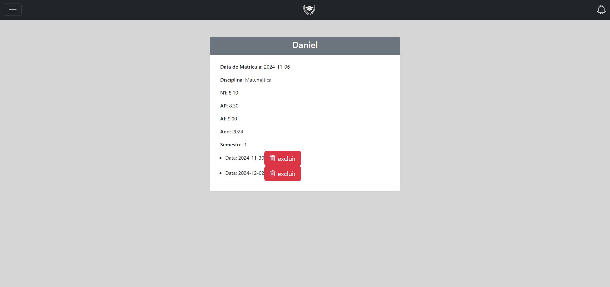
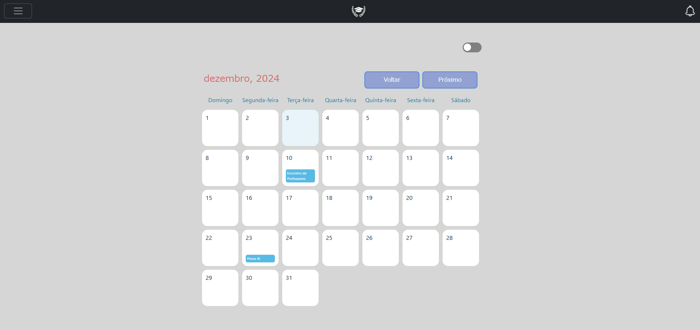

# SmartClass

SmartClassは、学校向けの効率的な成績および出欠管理システムです。このシステムを通じて、教員や管理者は簡単に生徒の情報を追跡でき、生徒と保護者も情報を簡単に閲覧できます。

## 🌐 デプロイ済みリンク
アプリケーションはこちらからアクセス可能です:  
**[https://smartclass-principal.onrender.com](https://smartclass-principal.onrender.com)**

---

## 📌 機能

- **ログイン・ユーザー認証**: ユーザーごとに異なるアクセス権限。
- **成績管理**: 生徒の成績（N1, AP, AIなど）を登録・確認。
- **出欠管理**: 欠席情報の記録と理由（正当化）の管理。
- **データ管理**: 学校、クラス、教師、生徒の情報を登録・編集。

---

## 📸 スクリーンショット

以下にアプリの主要画面を紹介します:

1. **ログイン画面**  
   


2. **成績管理画面**  
   
   


3. **出欠管理画面**  
   
   


4. **保護者ダッシュボード**  
   

4. **カレンダー**  
   
---

## ⚠️ 既知の問題

- 生徒検索機能が特定の条件下で正確に動作しない。
- モバイル表示の一部レイアウト調整が未完了。
- クラスごとに大量の生徒データがある場合、ページの読み込み速度が遅くなる。

---

## 💻 セットアップ方法

1. リポジトリをクローンします:
   ```bash
   git clone https://github.com/username/SmartClass.git
